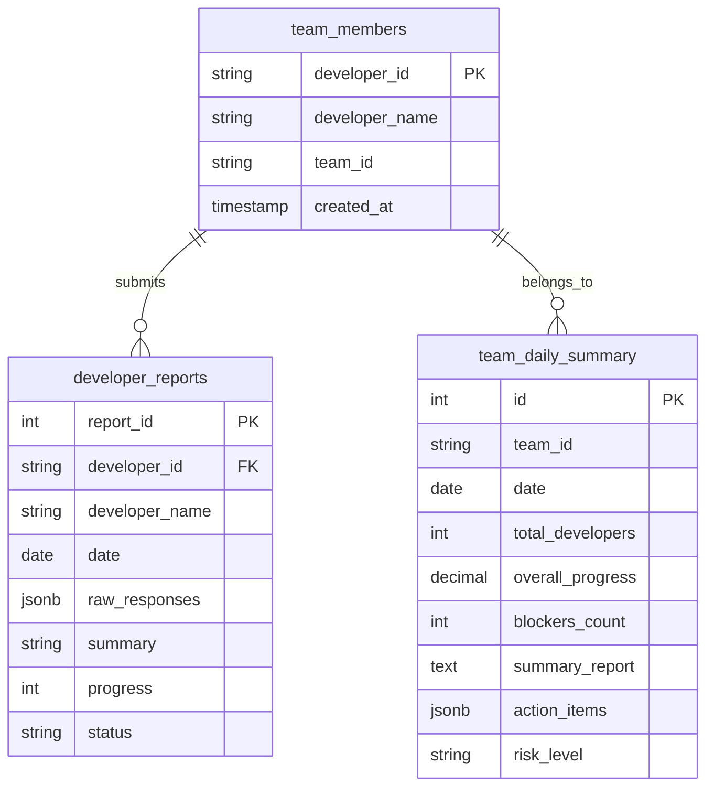

# Astrafenix AI - LangGraph-Powered Daily Reporting System

## 📋 Overview

Astrafenix AI is an intelligent daily reporting system that leverages LangGraph to create structured workflows for team communication and project management. The system consists of two primary agents that work together to streamline the reporting process for development teams.

### 🎯 Key Features

- **Interactive Daily Reports**: Guided question-based reporting for developers
- **AI-Powered Summaries**: Natural language generation using Ollama (LLaMA 3.1)
- **Team Aggregation**: Automatic collection and summarization of team reports
- **Database Persistence**: PostgreSQL storage for historical tracking
- **LangGraph Orchestration**: Stateful workflow management with conditional routing
- **Risk Assessment**: Automated identification of blockers and project risks

## 🏗️ System Architecture

```
┌─────────────────────────────────────────────────────────────┐
│                     Orchestrator                             │
│  ┌─────────────────┐    ┌─────────────────┐                │
│  │  Reporting      │    │  Summarizing    │                │
│  │  Workflow       │    │  Workflow       │                │
│  └────────┬────────┘    └────────┬────────┘                │
│           │                      │                          │
│    ┌──────▼──────┐         ┌──────▼──────┐                 │
│    │  Database   │◄────────│   Ollama    │                 │
│    │  Manager    │         │   (LLaMA)    │                 │
│    └─────────────┘         └─────────────┘                 │
└─────────────────────────────────────────────────────────────┘
```

## 📁 Project Structure

```
astrafenix-ai/
├── orchestrator.py          # Main system orchestrator
├── reporting_agent.py       # Individual reporting workflow
├── summarizing_agent.py     # Team summary generation
├── database_manager.py      # Database connection handler
├── requirements.txt         # Project dependencies
├── .env                    # Environment configuration
└── README.md               # Documentation
```

## 🔧 Prerequisites

- Python 3.8+
- PostgreSQL 12+
- Ollama with LLaMA 3.1 model
- pip (Python package manager)

## 🚀 Installation

### 1. Clone the Repository
```bash
git clone https://github.com/yourusername/astrafenix-ai.git
cd astrafenix-ai
```

### 2. Set Up Python Virtual Environment
```bash
python -m venv venv
source venv/bin/activate  # On Windows: venv\Scripts\activate
```

### 3. Install Dependencies
```bash
pip install -r requirements.txt
```

### 4. Configure Environment Variables
Create a `.env` file in the project root:
```env
DB_HOST=localhost
DB_NAME=astrafenix
DB_USER=postgres
DB_PASSWORD=your_password
```

### 5. Set Up PostgreSQL Database

Run the following SQL commands to create the necessary tables:

```sql
-- Team members table
CREATE TABLE team_members (
    developer_id VARCHAR(50) PRIMARY KEY,
    developer_name VARCHAR(100) NOT NULL,
    team_id VARCHAR(50),
    created_at TIMESTAMP DEFAULT NOW(),
    updated_at TIMESTAMP DEFAULT NOW()
);

-- Individual developer reports
CREATE TABLE developer_reports (
    report_id SERIAL PRIMARY KEY,
    developer_id VARCHAR(50) REFERENCES team_members(developer_id),
    developer_name VARCHAR(100) NOT NULL,
    date DATE NOT NULL,
    raw_responses JSONB,
    summary TEXT,
    progress_percentage INTEGER,
    status VARCHAR(20) DEFAULT 'submitted',
    created_at TIMESTAMP DEFAULT NOW(),
    updated_at TIMESTAMP DEFAULT NOW(),
    UNIQUE(developer_id, date)
);

-- Team daily summaries
CREATE TABLE team_daily_summary (
    id SERIAL PRIMARY KEY,
    team_id VARCHAR(50) NOT NULL,
    date DATE NOT NULL,
    total_developers INTEGER,
    reports_submitted INTEGER,
    overall_progress DECIMAL(5,2),
    blockers_count INTEGER,
    summary_report TEXT,
    action_items JSONB,
    risk_level VARCHAR(20),
    created_at TIMESTAMP DEFAULT NOW(),
    updated_at TIMESTAMP DEFAULT NOW(),
    UNIQUE(team_id, date)
);

-- Create indexes for performance
CREATE INDEX idx_dev_reports_date ON developer_reports(date);
CREATE INDEX idx_dev_reports_dev ON developer_reports(developer_id);
CREATE INDEX idx_team_summary_date ON team_daily_summary(date, team_id);
```

### 6. Install and Configure Ollama

```bash
# Install Ollama (if not already installed)
curl -fsSL https://ollama.com/install.sh | sh

# Pull the LLaMA 3.1 model
ollama pull llama3.1:8b

# Verify installation
ollama list
```

## 💻 Usage

### Starting the System

```bash
python orchestrator.py
```

### Menu Options

```
🤖 Astrafenix AI - Powered by LangGraph

Please choose an option:

1.  Submit Daily Report (Individual Developer)
2.  Generate Team Summary (Team Lead/Manager)
0.  Exit System
```

## 📊 Workflow Details

### 1. Reporting Agent (Individual Developer)

The reporting agent guides developers through a structured 5-question process:

| Question | Purpose | Validation |
|----------|---------|------------|
| Completed Tasks | Document daily accomplishments | Required |
| Progress Percentage | Track task completion | 0-100 numeric |
| Blockers | Identify obstacles | Optional |
| Tomorrow's Plan | Plan next steps | Required |
| Additional Notes | Extra context | Optional |

**Workflow Steps:**
1. **Verify Developer**: Checks developer ID against database
2. **Ask Questions**: Interactive Q&A with validation
3. **Save to Database**: Persists responses with timestamp
4. **Generate Report**: Creates AI-enhanced narrative
5. **Display Report**: Shows formatted output

### 2. Summarizing Agent (Team Lead)

Aggregates individual reports into team-level insights:

**Workflow Steps:**
1. **Get Team Info**: Collects team ID and date range
2. **Fetch Reports**: Retrieves all team members' reports
3. **Generate Summary**: Creates comprehensive team overview
4. **Save Summary**: Stores aggregated data
5. **Display Results**: Shows team metrics and insights

**Generated Metrics:**
- Average team progress
- Blocker identification
- Risk level assessment
- Action item extraction
- Individual contributions

## 🤖 AI Integration

### Ollama Configuration

```python
response = ollama.chat(
    model="llama3.1:8b",
    messages=[
        {
            "role": "system",
            "content": "You are a project manager creating team summaries."
        },
        {
            "role": "user", 
            "content": prompt
        }
    ],
    options={
        "temperature": 0.3,      # Low for consistent output
        "top_p": 0.9,            # Nucleus sampling
        "num_predict": 800        # Max token length
    }
)
```

### Prompt Engineering

**Individual Report Prompt:**
```
Create a professional daily report:

DEVELOPER: {name}
DATE: {date}
TASKS: {tasks}
PROGRESS: {progress}%
BLOCKERS: {blockers}
TOMORROW: {tomorrow}
NOTES: {notes}
```

**Team Summary Prompt:**
```
Create a team daily summary:

TEAM: {team_id}
DATE: {date}
DEVELOPERS: {count}
AVG PROGRESS: {avg}%
BLOCKERS: {blocker_count}

INDIVIDUAL REPORTS:
{developer_details}
```

## 🔄 State Management with LangGraph

### Reporting State Definition

```python
class ReportingState(TypedDict):
    developer_id: str
    developer_name: str
    answers: Dict[str, str]
    current_question_index: int
    structured_report: Dict[str, Any]
    generated_summary: str
    final_report: str
    report_id: Optional[int]
    should_continue: bool
    messages: Annotated[List[Dict[str, str]], add_messages]
```

### Conditional Routing

```python
# Example of conditional edge
workflow.add_conditional_edges(
    "verify_developer",
    self.decide_next_after_verification,
    {
        "continue": "ask_questions",
        "end": END
    }
)
```

## 📈 Database Schema Relationships



## 🛠️ Error Handling

The system implements comprehensive error handling:

- **Database Connection Failures**: Graceful fallback with user notification
- **AI Service Unavailable**: Template-based report generation
- **Invalid Input**: Validation and retry prompts
- **Missing Data**: Clear error messages and workflow termination

Example error handling:
```python
try:
    response = ollama.chat(model="llama3.1:8b", messages=[...])
    state["final_report"] = response['message']['content']
except Exception as e:
    print(f"⚠️ AI generation failed: {e}")
    state["final_report"] = self._generate_template_report(state)
```

## 🔍 Testing

### Sample Test Data

```sql
-- Insert test developer
INSERT INTO team_members (developer_id, developer_name, team_id) 
VALUES ('DEV001', 'John Doe', 'TEAM-A');

-- Insert test report
INSERT INTO developer_reports 
(developer_id, developer_name, date, raw_responses, summary, progress_percentage)
VALUES (
    'DEV001', 
    'John Doe', 
    CURRENT_DATE,
    '{"completed_tasks": "Implemented login feature", "blockers": "None", "tomorrow_plan": "Add tests"}',
    'Implemented login feature | Progress: 75%',
    75
);
```

## 📝 Logging and Monitoring

The system provides real-time feedback:
- ✅ Success indicators
- ❌ Error messages
- ⚠️ Warning for AI failures
- 📊 Progress summaries
- 📈 Performance metrics

## 🔐 Security Considerations

- **Environment Variables**: Sensitive data stored in `.env`
- **Input Validation**: All user input validated before processing
- **SQL Injection Prevention**: Parameterized queries
- **Authentication**: Developer ID verification

## 🚧 Limitations and Future Improvements

### Current Limitations
- Single Ollama model support
- Basic authentication
- No web interface
- Limited to daily reporting

### Planned Enhancements
- [ ] Web dashboard with real-time updates
- [ ] Multiple AI model support
- [ ] Email notifications
- [ ] Custom report templates
- [ ] Export functionality (PDF, Excel)
- [ ] Historical trend analysis
- [ ] Team performance dashboards

## 🤝 Contributing

1. Fork the repository
2. Create a feature branch (`git checkout -b feature/AmazingFeature`)
3. Commit changes (`git commit -m 'Add AmazingFeature'`)
4. Push to branch (`git push origin feature/AmazingFeature`)
5. Open a Pull Request

## 📄 License

This project is licensed under the MIT License - see the LICENSE file for details.

## 🙏 Acknowledgments

- LangGraph for workflow orchestration
- Ollama for local LLM support
- PostgreSQL community
- All contributors and testers

## 📞 Support

For issues and questions:
- Open an issue on GitHub
- Contact the development team
- Check the documentation

---

**Built with ❤️ using LangGraph and Ollama**
